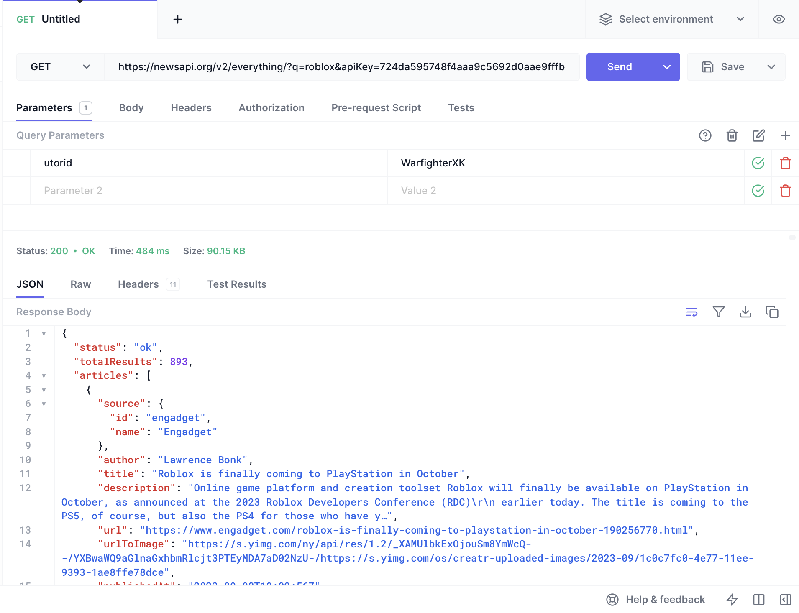
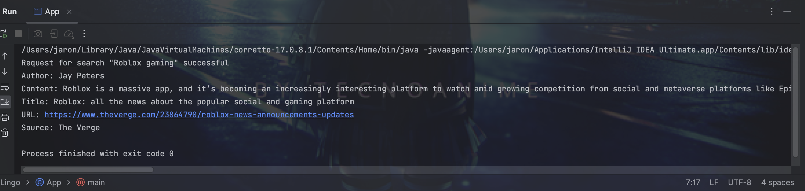

## Description of Problem Domain
The current roaster of mainstream news sources from websites can be overwhelming in its content and presentation. The New York Times, Fox and CNN have also been plagued with concerns of biased reporting and bombarding their viewers with advertisements. Most readers will be so smart as to fill their digest with diverse news sources, which can pose threats to reader accessibility, including variations in layouts and fonts. Such issues would require too much time spent on adjustment and not enough on reading the news!

## InfoLingo
Our team will build a centralised news app. By this, we mean to build an app that will organise news from a variety of sources into one location. It will also have a translation tool to increase the cross-cultural accessibility and reach of news, providing an array of multilingual perspectives. We will use an API to auto-generate summaries of articles so that readers will be able to parse content more easily. In this regard, we hope to retain the benefits of a traditional centralised news source's consistency without as much of its bias.

## Link to APIs
- NewsAPI - https://newsapi.org 
- LibreTranslate - https://libretranslate.com/
- HuggingFace - https://huggingface.co

## API Call via GUI 

## API Call via Java

## Technical Problems
- Request limits for API calls
- Parsing API call return format, particularly when it does not conform to what's listed in the documentation
- Lack of cooperation between teammates
- Lack of funds to use better APIs / improve rates on currently used APIs
- Unfamiliarity with Java as compared to Python
