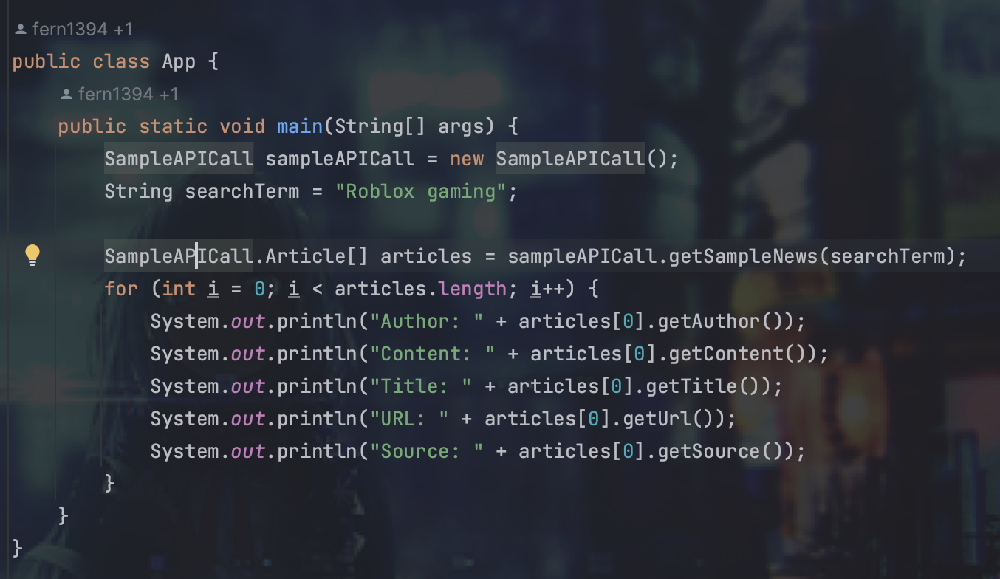

```Java
String[] developers = {"Dominic Le", "Seth Blatt", "Jaiz Jeeson", "Jaron Fernandes"};
```

## Description of Problem Domain
The current roster of mainstream news sources from websites can be overwhelming in its content and presentation. The New York Times, Fox and CNN have also been plagued with concerns of biased reporting and bombarding their viewers with advertisements. Most readers will be so smart as to fill their digest with diverse news sources, which can pose threats to reader accessibility, including variations in layouts and fonts. Such issues would require too much time spent on adjustment and not enough on reading the news!

## InfoLingo
Our team will build a centralised news app. By this, we mean to build an app that will organise news from a variety of sources into one location. It will also have a translation tool to increase the cross-cultural accessibility and reach of news, providing an array of multilingual perspectives. We will use an API to auto-generate summaries of articles so that readers will be able to parse content more easily. In this regard, we hope to retain the benefits of a traditional centralised news source's consistency without as much of its bias.

## Specifications
- Built-in auto-translation tool.
- Ability to auto-generate summaries with tailored lengths.
- Auto-removal of duplicate articles.
- Capacity to group articles with similar content.
- Article ranking based on user-specific preferences.

## Setup
The project uses Maven dependencies which needs a Java (corretto) 20 SDK.
You can set this up by going to Project Structure --> Project Settings --> Project --> SDK

If you do not have this SDK, you can download it through IntelliJ. If you do not have IntelliJ, your
IDE may or may not have it, so you may have to download it manually.

After you have set up the project, see the **Instructions for Usage** section.

__**Note:**__ when you run `Main.java` for the first time, you may get a compilation error stating
that a bunch of classes were not found. You can fix this by going into the top-layer files, finding the `target` folder,
and deleting it.

## API Usage
Please be aware that our News Article Retrieval and Translation API tokens have limited requests,
notably article retrieval with 50 max requests a day and DeepL translate with approximately 122,368/500,000 characters at
the moment.

It is unlikely you will go over the translation API usage, but do not carelessly translate articles, even with translated
articles being stored using memoization.

Please be aware of this usage when you run the program!

## Instructions for Usage
- Click on "Run" to launch home screen.
- Home screen includes search bar, preferences bar, filter button, group button and search button.
- Click on preferences bar to choose desired country of origin and publishing date.
- Type keywords into search bar and click search button. This displays a list headlines related to keywords.
- Click group button to create list of groups to the right of headlines. Toggle between groups to access headlines under the same group.
- Click on preferences bar again to choose country of origin and publishing date and click filter button to narrow down headlines displayed.
- Click on desired headline. This displays an article in 3 columns, a summary button, a summary length slider, a translate button, and a language bar.
- Change slider to adjust the number of words required in generated summary and click summary button. This generates a summary of the first column in the second column.
- Click on translate bar to choose desired language and click translate button. This translates the first column and displays it in the third.

## Test Cases
Our test cases can be located under the `tests` folder. Note that unlike the main program,
the test cases call our *Testing News Retrieval API*, which retrieves different (and shortened article texts)
news article, so it will not be the exact same as the default news API. This is because running all the tests
will immediately use up the daily maximum requests.

## APIs
- NewsAPI - https://newsapi.org
- DeepL Translate - https://www.deepl.com/docs-api/translate-text
- MeaningCloud Summarization API - https://www.meaningcloud.com/developer/summarization
- World News API - https://worldnewsapi.com/

## API Call via GUI 


## API Call via Java



## Technical Problems
- Request limits for API calls
- Parsing API call return format, particularly when it does not conform to what's listed in the documentation
- Lack of cooperation between teammates
- Lack of funds to use better APIs / improve rates on currently used APIs
- Unfamiliarity with Java as compared to Python
