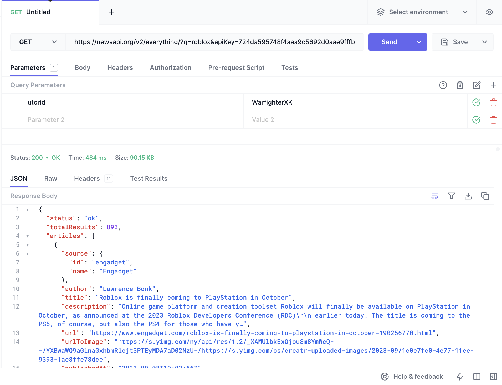
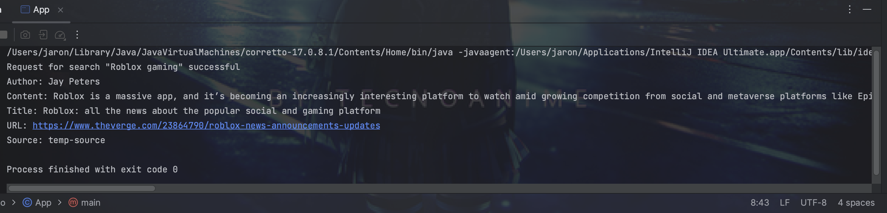

# InfoLingo
Csc207 project InfoLingo 📰 📰 📰

A readme.md file which must include:
## a description of the problem domain your team is tentatively wanting to focus on in the project. (e.g., trivia, finance, real estate, etc…) []
The current roaster of mainstream news sources from websites can be overwhelming in its content and presentation. 
The New York Times, Fox, CNN have also been plagued with concerns of biased reporting and bombarding their viewers with advertisements. 
Most readers will be smart to fill their digest with diverse news sources, which can pose readers accessibility challenges as
each site will have different fonts, layouts, that would require too much time spent on adjustment and not on reading the news!

##  a brief, high-level description of what kind of application your team is thinking of developing.
###  This is mostly just so we can give you some initial feedback on whether your team might want to reconsider your project direction. []

Our team is thinking of focusing on a centralised news app. The app will organise news from a variety of sources into one 
location. It will also have a translation tool, so that multiple languages will be accessible to readers and more 
multilingual perspectives have greater reach. We will use an API to auto-generate summaries of articles, so readers 
will be able to go through more content more easily. In this regard, we will also have the benefits of
of traditional centralised news sources' consistency without as much of their bias.

## a link to the documentation for an API your team can use related to the domain. []
https://currentsapi.services/en 

https://libretranslate.com/

## a screenshot of using a tool to try out the API (like https://www.postman.com/Links to an external site. or https://hoppscotch.io/Links to an external site.Links to an external site.) []

## example output of running your Java code (see below). []

## a list of any technical problems blocking progress (if any) []
- Discord mic issues
- Teammates not cooperating
- lack of funding
- I want Jonathan Calver on my team
- what's Java?
## please don't hesitate to ask such questions on Piazza too of course. []
